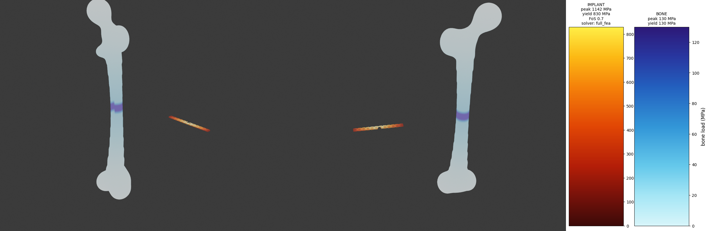
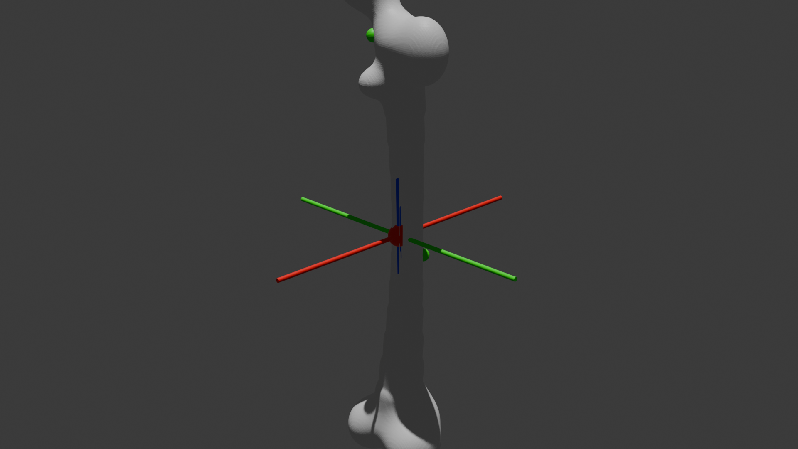
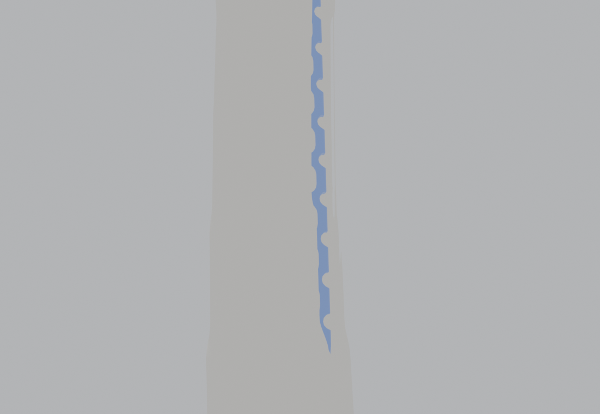

# Osteon

**A resilient AI agent that designs patient-specific orthopedic implants — localizing the bone, synthesizing the implant geometry in Blender, and evaluating it under biomechanical load, in a closed loop that never breaks when a model, provider, or tool fails.**

[](./LICENSE)


Built for the **Resilient Agents** hackathon (TrueFoundry + AWS Bedrock).

<p align="center">
  
</p>

---

## What it does

Given a clinical case — a bone mesh, a defect, and a load profile — Osteon runs a closed agentic loop:

```
CaseSpec ─▶ [A] Localize ─▶ PlacementPlan ─▶ [B] Synthesize ─┬▶ ImplantCandidate ─▶ [C] Evaluate ─▶ StressReport
                                                             ▲                                          │
                                                             └──────────── iterate on θ ◀───────────────┘
```

| Stage | Role | Input → Output |
|---|---|---|
| **A · Localization** | Finds anchor coordinates and a PCA frame on the cortical bone | `CaseSpec` → `PlacementPlan` |
| **B · Synthesis** | Generates and places a parametric locking plate; drives the iteration | `PlacementPlan` → `ImplantCandidate` |
| **C · Evaluation** | Runs 3-point-bending FEA — factor of safety, fatigue, stress shielding | `ImplantCandidate` → `StressReport` |

<p align="center">
  
  
  
</p>

---

## The point: resilience

Every model call goes through the **TrueFoundry AI Gateway** to **AWS Bedrock**; every stage is wrapped in a standardized **3-rung fallback ladder** whose floor *never raises*; everything emits one trace. The loop is built to keep producing a schema-valid implant even as infrastructure fails underneath it.

The dashboard makes three of those failures reproducible on demand, and surfaces each recovery as evidence — both in the `/api/gen` response and in a banner on the stage:

| Inject (button) | What breaks | How it recovers | Evidence returned |
|---|---|---|---|
| ⚡ **Revoke Bedrock** | Primary model (`claude-sonnet`) errors | AI Gateway reroutes to `llama-70b` | `recovery: { failover: true, model_used: "bedrock/llama-70b" }` |
| ⏱ **FEA timeout** | Full 3-D FEA solver unavailable | Falls to 1-D beam model, then closed-form bound | `recovery: { rung: 2, solver: "reduced_surrogate" }` |
| 🛡 **Bad θ thickness** | LLM proposes a 99 mm plate | Pre-invoke guardrail rejects it *before* meshing; CMA-ES substitutes a valid implant | `recovery: { guardrail_blocked: true, substituted_rung: "cma-es", blender_invoked: false }` |

Each injection is a **simulated, reversible** `OSTEON_FORCE_FAIL` toggle held only while the engines run — no credentials, meshes, or files are touched, and every run still ends with a valid implant and report.

---

## Quickstart

**Prerequisites:** Python 3.11, [Blender](https://www.blender.org/download/) (for live rendering), and a TrueFoundry AI Gateway token with AWS Bedrock access.

```bash
git clone https://github.com/PranavAchar01/osteon.git && cd osteon
python3.11 -m venv .venv && source .venv/bin/activate
pip install -r requirements.txt          # full scientific stack
pip install -e .                          # register the `osteon` package

cp .env.example .env                      # set TFY_TOKEN + TFY_GATEWAY_URL
export OSTEON_BLENDER=/path/to/blender    # e.g. /Applications/Blender.app/Contents/MacOS/Blender
```

**Run the dashboard:**

```bash
python webapp/app.py        # → http://127.0.0.1:5001
```

Click **⚙ Start generation** to run Split A → B → C live, then use the **RESILIENCE** toolbar (⚡ / ⏱ / 🛡) to inject each failure and watch it recover.

**Run a single case headless:**

```bash
python orchestrator.py fixtures/example_case.json
# → { passed, factor_of_safety, solver_used, iterations, trace_id }
```

---

## Deployment

The repo ships a containerized deploy path that bakes Blender into the image so live rendering works in the cloud:

- **[`Dockerfile`](./Dockerfile)** — `python:3.11` + Blender 5.1.2 (headless) + CPU-only torch + the FEA toolchain; serves the dashboard via gunicorn. Builds to a ~2.2 GB `linux/amd64` image.
- **[`deploy.py`](./deploy.py)** — a TrueFoundry `Service` spec; all account-bound values (workspace, host, token) are read from env, nothing hardcoded.
- **[`scripts/keepalive.py`](./scripts/keepalive.py)** — a self-healing supervisor that keeps the dashboard + a pinned public tunnel alive, restarting whichever dies.

```bash
docker build -t osteon-dashboard .
# or deploy to TrueFoundry (requires a workspace + deploy token):
export TFY_WORKSPACE_FQN='<cluster>:<workspace>' OSTEON_HOST='osteon.<domain>'
export $(grep -E 'TFY_TOKEN|TFY_GATEWAY_URL' .env | xargs)
python deploy.py
```

---

## Architecture

```
osteon/
├── common/                  # shared contract layer (frozen interface)
│   ├── llm.py               # the one AI Gateway client + model-level fallback (F1 lives here)
│   ├── contracts.py         # CaseSpec, PlacementPlan, ImplantCandidate, StressReport
│   ├── ladder.py            # the standardized 3-rung fallback ladder (never raises)
│   ├── errors.py            # shared error taxonomy
│   └── trace.py             # span + JSONL trace emitter
├── split_a_localization/    # Stage A — anchors + coordinate frame
├── split_b_synthesis/       # Stage B — parametric plate + CMA-ES controller (F3 guardrail)
├── split_c_evaluation/      # Stage C — sfepy FEA → beam → analytic floor (F2 ladder)
├── webapp/                  # Flask dashboard + Blender render scripts + /api/gen
├── orchestrator.py          # chains A → B ↔ C end to end
├── Dockerfile · deploy.py   # containerized TrueFoundry deploy
└── STANDARDIZATION.md       # the compatibility contract between the stages
```

Each stage is independently runnable against frozen fixtures and mocks — see each split's `SETUP.md`.

---

## Testing

```bash
pytest -q        # 34 tests: offline split A/B/C acceptance suites + smoke
```

The suites verify the happy path *and* the fallback rungs (forced solver timeout → surrogate → floor, out-of-bounds θ rejection, injected-NaN guardrail), all offline with no gateway dependency.

---

## Scope & disclaimer

This is a hackathon MVP, **not** a clinical or FDA-validated tool. It uses open/synthetic bone data and simplified FEA. The focus is the resilience and recovery story — graceful degradation across models, providers, and tools — not implant fidelity.

## License

[MIT](./LICENSE) © 2026 Pranav Achar
